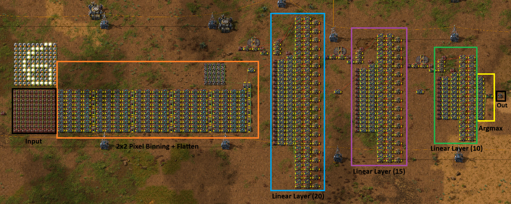
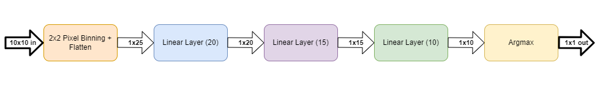
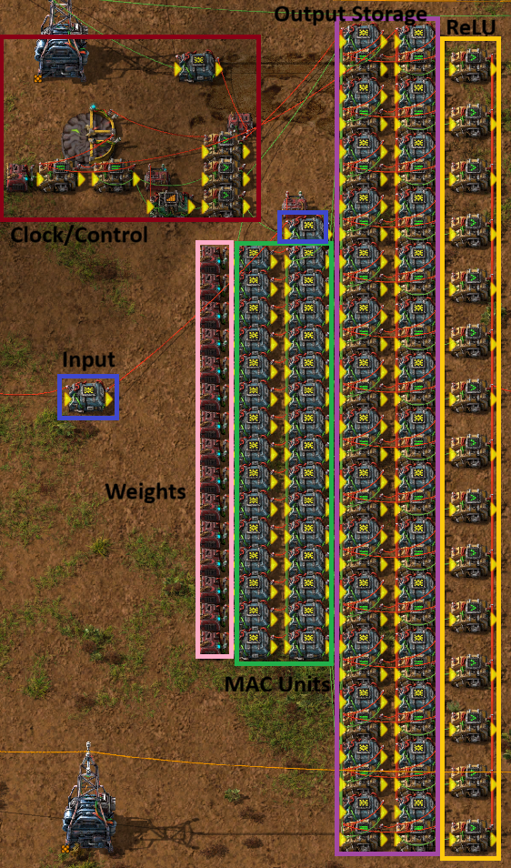

# MNIST in Factorio

An implementation of MNIST in Factorio.

Demo Video: 

https://github.com/user-attachments/assets/0b892e42-d5a7-46c6-9346-37f707f79fbd

Part of my goal was keeping the network small, so I had to make some tradeoffs, but I was still able to get over 92% test accuracy. The network ended up being 950 parameters and not using convolutions, just three fully connected layers, the first two using ReLU activations and the last using an argmax (equivalent to softmax in this case). Scaling the network up would be an easy way to get better results, but it went against my self-imposed challenge, so I decided not to for now (planned for the future!).

#### Full Annotated Network:

#### Diagram:

#### Annotated Linear Layer:

The network was trained using PyTorch then the weights were exported as constant combinators using the blueprint json format. The matrix multiplications were manually designed and built though (based off MAC units). Here is some of the matrix multiplication design progression for anyone interested: https://imgur.com/a/yDWehWp

### MNIST 

Images from the original MNIST dataset are 28x28, so 784 pixels in total. You may notice though, the input size of the network is 25 pixels (1x25) for an image, that's only 3% of the original pixel information and yet accuracy was still over 92%!
Resizing directly from a 28x28 image to 5x5 would completely destroy most of the usable information, so this is a high-level overview of the preprocessing I did:
28x28 -> resize 16x16 -> remove 3-pixel border -> binarize -> 2x2 pixel binning
